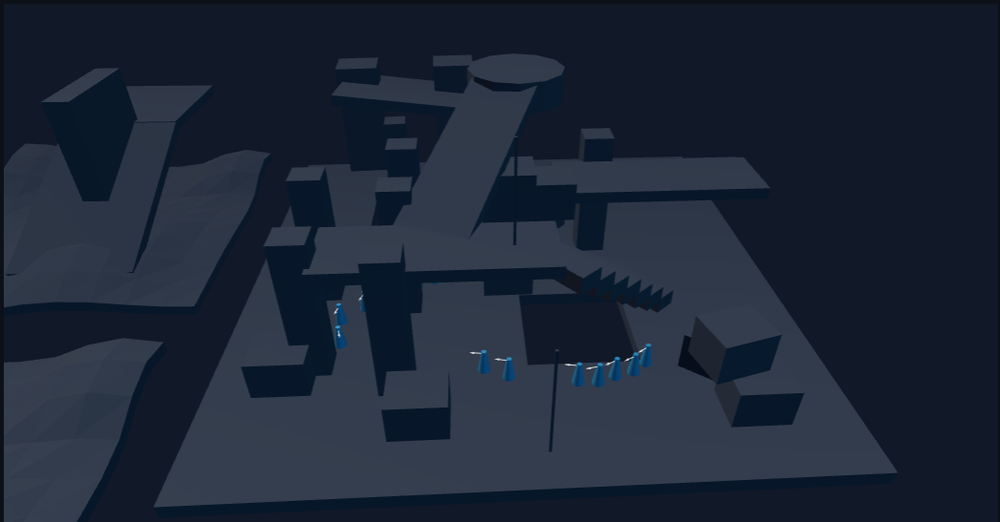

# What is this all about

In a 3D environment context, Recast.js is meant to be used with a file describing a scene geometry. Using the [recastnavigation](https://github.com/recastnavigation/recastnavigation) C++ library compiled to WebAssembly, it will deduce a [navigation mesh](https://en.wikipedia.org/wiki/Navigation_mesh): a set of polygons on which your characters can move.

Once this navigation mesh is computed, it is possible to use built-in pathfinding operations like "find the shortest path between point A and point B", taking into account obstacles, slopes, and off-mesh connections.

If you decide to use it to animate your scene characters aka "agents", it also provides a complete crowd system capable of managing all your agents movements using per-agent settings (speed, radius, ...).

[play the pathfinding demo](https://vincent.github.io/recast.js/tests/browser/webgl/test.webgl)

## What can you do with it

### Navmesh building
* load any mesh in `.obj` format
* compute its navigation mesh with configurable parameters (cell size, agent height, slope angle, ...)
* build a solo navmesh or a tiled navmesh (better for large scenes and dynamic obstacles)
* save and load the computed navmesh to skip recomputation

### Pathfinding
* find the shortest path between two points
* find the nearest navigable point or polygon to any world position
* get a random point guaranteed to be on the navmesh

### Obstacles & navigation areas
* place and remove temporary obstacles
* define off-mesh connections (jump links, doors, portals)
* assign polygon flags and group them into zones to influence pathfinding
* with instant effect, no rebuild needed

### Crowd simulation
* add agents to the navmesh and drive them with a full crowd simulation
* update agents individually (speed, radius, separation weight, ...)

## Demos

Browser demos are available in [tests/browser/](https://vincent.github.io/recast.js/tests/browser):

* **webgl** — WebGL rendering, crowd, obstacles and offmeshs links
* **doors** — off-mesh connections for door traversal
* **worker** — running recast inside a Web Worker (work in progress)

